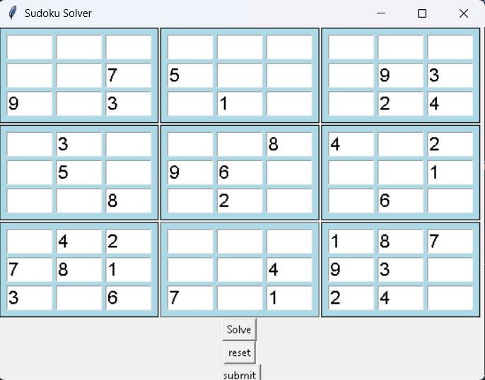
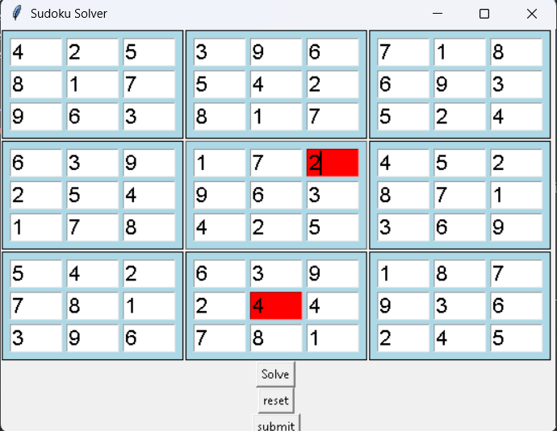

# SudokuSolverAndChecker
Sudoku solver and check using GUI tkinter 

To Run the code : go to Python-sudoku-master-solver-and-generator-artificial-intelligence-master folder and run app.py file using python3 app.py command in terminal.
you can play with the code and make it better.

after cliking on submit button it will show the solved sudoku and wrong input will be shown in red color.
